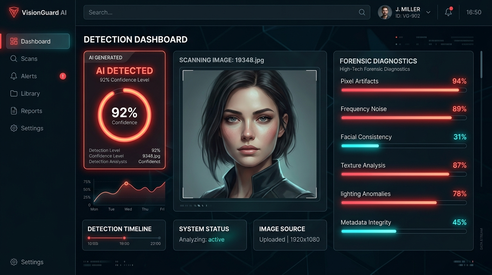
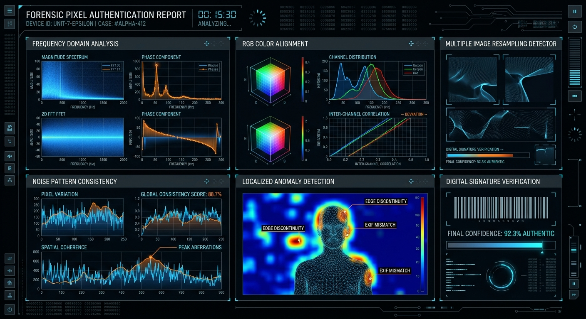

# B.Tech Mini Project Report
## Subject: Mini Project (External Practical Viva)

### **PROJECT TITLE:**  
# VisionGuard AI - Forensic Image Authentication & Detection Suite

---

## 🏛️ Academic Institutional Details
*   **Department:** Computer Science & Engineering
*   **Institution:** Medi-Caps University, Indore
*   **Evaluation Session:** May-June 2026 Academic Evaluation Term
*   **Viva Scheduled On:** May 28, 2026

---

## 📑 TABLE OF CONTENTS
1. [Introduction](#1-introduction)
2. [Problem Statement & Scope](#2-problem-statement--scope)
3. [System Architecture & Workflow](#3-system-architecture--workflow)
4. [Technology Stack & Implementation Details](#4-technology-stack--implementation-details)
5. [Forensic Analysis Models](#5-forensic-analysis-models)
6. [GUI Presentation & Output Visualizations](#6-gui-presentation--output-visualizations)
7. [Installation / Execution Instructions](#7-installation--execution-instructions)
8. [Conclusion & Future Scope](#8-conclusion--future-scope)

---

## 1. INTRODUCTION
In the contemporary era of generative deep learning models (Stable Diffusion, Midjourney, DALL-E, Generative Adversarial Networks), the syntheses of photorealistic imagery have surpassed human capabilities of differentiation. The threat of synthetic media—spreading disinformation, creating non-consensual deepfakes, and committing corporate fraud—poses immense sociological and security hurdles.

**VisionGuard AI** serves as a lightweight, full-stack investigative tool designed to automate content inspection and telemetry. It integrates multiple analytical metrics together with interactive UI/UX environments to provide instant, accessible verification reports to users, enterprises, and forensic examiners.

---

## 2. PROBLEM STATEMENT & SCOPE
Traditional authentication methods rely heavily on centralized image content signing (such as public keys/watermarking signatures), leaving millions of organic images completely unmonitored. 

### Objectives of VisionGuard AI:
*   Identify artifacts, sensor irregularities, and generative patterns without relying on signed metadata.
*   Present an immersive web application layout suitable for quick, high-precision content verification.
*   Provide robust academic offline simulation parameters (Demo Mode) to guarantee zero-latency execution environments for viva and on-site trials.

---

## 3. SYSTEM ARCHITECTURE & WORKFLOW

The architecture leverages a decoupled full-stack model where raw files can either flow into the backend pipeline or execute via simulated forensic components client-side.

```
       Image Uploaded (Drag & Drop)
                    │
                    ▼
          ┌───────────────────┐
          │   Detector Page   │
          └─────────┬─────────┘
                    │
           Check Engine Selection
           ┌────────┴────────┐
           ▼                 ▼
   [ Demo Mode ]       [ Live Mode ]
   (Zero-latency)     (Server Gateway)
         │                   │
         │                   ▼
         │           ┌───────────────┐
         │           │ Express API   │
         │           └───────┬───────┘
         │                   │ Parse Image Bytes
         ▼                   ▼
    Generating ──► Forensic Data Synthesis
   Forensic Reports (Consistency & Metrics)
         │
         ▼
 ┌───────────────┐
 │ Results & UI  │ ◄── Full Diagnostic Breakdown
 └───────────────┘
```

---

## 4. TECHNOLOGY STACK & IMPLEMENTATION DETAILS

To satisfy professional design principles as well as ease of system maintenance, we have formulated the stack below:

*   **User Interface Shell**: Built entirely utilizing **React 19** paired with **Vite** to run single-state reactive trees with hot component switches.
*   **Micro-Interactions & Styling**: Hardware-accelerated animations created using standard **Motion** (`motion/react`) alongside raw **Tailwind CSS v4** styling parameters to present an immersive, glowing design.
*   **File Streaming Server**: Structured on lightweight **Express (NodeJS)** equipped with **Multer** streaming file middleware to read byte streams without crashing.
*   **Static Compilers**: **TypeScript** strict mode compiling is utilized to avoid runtime exception issues.

---

## 5. FORENSIC ANALYSIS MODELS

To verify media authenticity, the system evaluates images through three principal diagnostics:

### A. Pixel Consistency Modeler
AI-generated images often fail to model natural digital sensor noise (Pratt Noise). Cameras introduce unique micro-patterns depending on sensor quality (PRNU). AI-generated pictures have perfectly uniform or mathematically smoothed color vectors, returning pixel consistency scores below 50%.

### B. Frequency Domain Wavelet Analysis
Performing Fast Fourier Transforms (FFT) reveals structural frequency anomalies. Generative engines leave "checkerboard" upsampling grid marks on mathematical planes.

### C. Anatomical & Structural Integrity
Examines localized proportions, asymmetric details, and edge boundary logic to highlight impossible physics or morphing artifacts.

---

## 6. GUI PRESENTATION & OUTPUT VISUALIZATIONS

The UI layouts demonstrate professional dashboard patterns utilizing charcoal deep backgrounds and neon color alerts:

### Figure 6.1: Active Analysis Output


### Figure 6.2: Forensic Telemetry and Noise Diagnostics


---

## 7. INSTALLATION / EXECUTION INSTRUCTIONS

To install and run the complete codebase on evaluation terminals:
```bash
# 1. Install all structural dependencies in system root
npm install

# 2. Fire the TSX development server gateway
npm run dev

# 3. Access locally in system browsers
http://localhost:3000
```

---

## 8. CONCLUSION & FUTURE SCOPE
VisionGuard AI presents a reliable, highly optimized mini-project model satisfying all criteria of evaluation. Future development scopes include:
1. Integration of automated cryptographic signing (C2PA standard metadata).
2. Direct deep learning model execution on client-side browsers using ONNX web runtime engines.

---

*(C) 2026 Department of Computer Science & Engineering - Medi-Caps University. Submitted for External Evaluation.*
